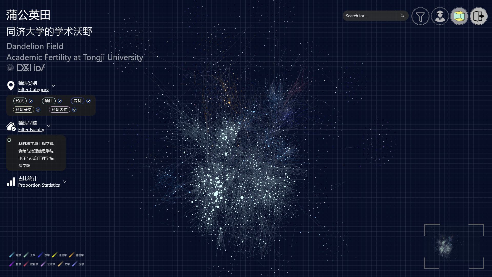
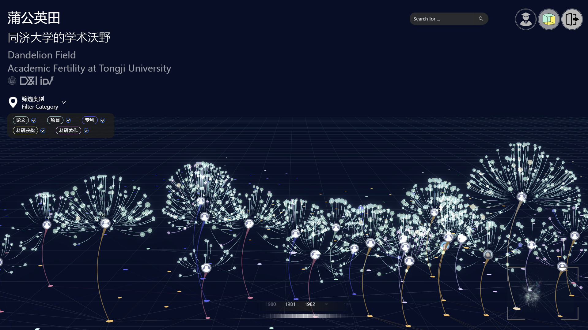

# Digital Dandelion Garden

It's a 3D data visualization project that visualizes the academic achievements and interdisciplinary collaboration of faculty in university. This is a practical, real-world project that has been deployed on large screens on the Tongji University campus.

---

## 🚀 Live Demo
- [▶ Watch on YouTube](https://youtu.be/lnrA8HmgY4w)  
- Also available in this repository: [`static/Demo.mp4`](./static/Demo.mp4)
---

## 📷 Screenshots
### Dashboard 1

The “Garden Landscape” provides a 2D overview of faculty collaborations via a force‐directed layout[1], where nodes represent faculties and are clustered by collaboration frequency.  

### Dashboard 2

The ``Dandelion Portrait'' visualizes individual faculty members' academic achievements and complements the macro-level view provided by the Garden Landscape.

### Visual Metaphor
  

### Data Encoding
 

---

## 🗄️ Data Source
- Internal database (not publicly available)  
- Placeholder API endpoints (http://example) are provided in this repository for reference

Since the project relies on a **private internal database**, external users cannot fully run the system due to data security.  
However, the **architecture, visualization components, and algorithms** included in this codebase are functional and can be reused or adapted in other projects.

---

## 🧰 Tech Stack

**Frontend:**
- [React](https://reactjs.org/)
- [Three.js](https://threejs.org/) – JavaScript 3D library for rendering 3D content
  
**Backend:**
- [Flask](https://flask.palletsprojects.com/)
- RESTful API design

**Database & Caching:**
- [MySQL](https://www.mysql.com/)
- [Redis](https://redis.io/) – In-memory data store used for caching

---

[1]: Force‐directed Layout Algorithm. Available at: [igraph](https://r.igraph.org/reference/layout_with_graphopt.html)
